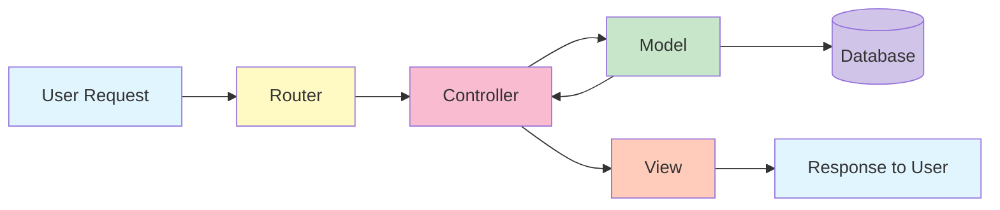
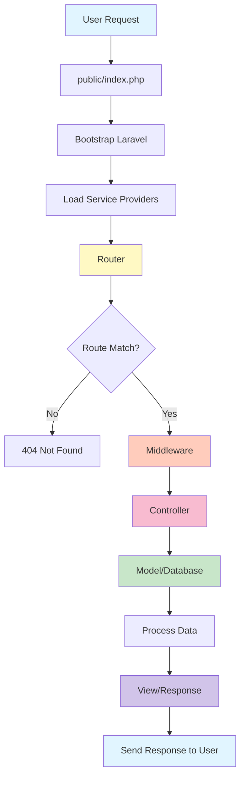
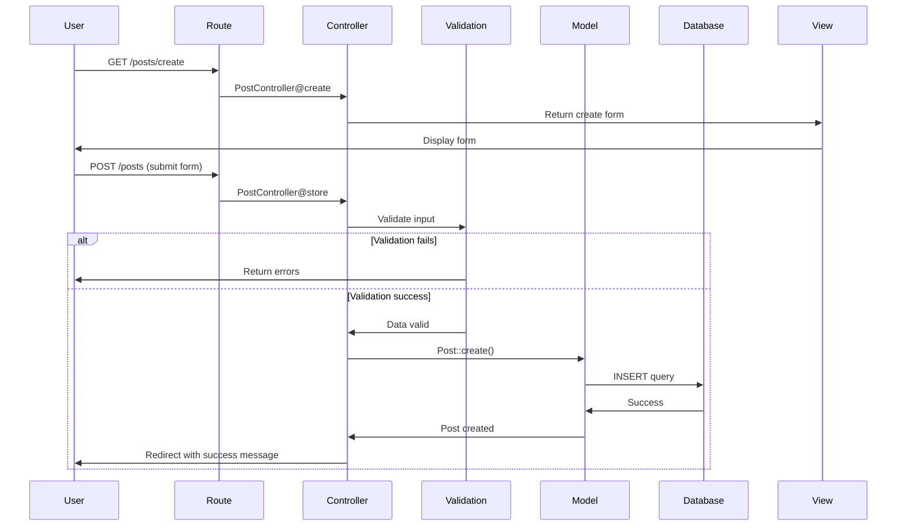
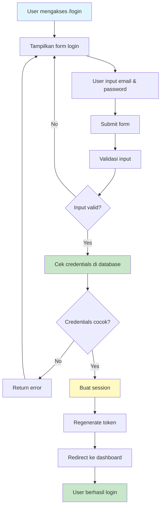

# 📚 Dokumentasi Laravel - Panduan Lengkap & Mudah Dipahami

> Dokumentasi ini dibuat untuk mempermudah pemahaman Laravel bagi developer Indonesia. Dilengkapi dengan contoh kode, study case, dan flowchart yang mudah dipahami.

## 📑 Daftar Isi

- [Pengenalan Laravel](#pengenalan-laravel)
- [Konsep MVC](#konsep-mvc)
- [Routing](#routing)
- [Controller](#controller)
- [Model & Eloquent ORM](#model--eloquent-orm)
- [Views & Blade Templating](#views--blade-templating)
- [Migration & Database](#migration--database)
- [Authentication](#authentication)
- [Study Case: Aplikasi Blog](#study-case-aplikasi-blog)
- [Flowchart Aplikasi Laravel](#flowchart-aplikasi-laravel)

---

## 🚀 Pengenalan Laravel

Laravel adalah **PHP Framework** yang paling populer untuk membangun aplikasi web modern. Laravel dibuat oleh Taylor Otwell dan dirilis pertama kali pada tahun 2011.

### Kenapa Laravel?

- ✅ **Mudah Dipelajari** - Sintaks yang bersih dan dokumentasi lengkap
- ✅ **MVC Architecture** - Kode terorganisir dengan baik
- ✅ **Eloquent ORM** - Interaksi database yang mudah
- ✅ **Blade Templating** - Template engine yang powerful
- ✅ **Security** - Protection terhadap SQL Injection, XSS, CSRF
- ✅ **Artisan CLI** - Command line tools yang membantu development
- ✅ **Community** - Komunitas besar dan aktif

### Instalasi

```bash
# Install Laravel via Composer
composer create-project laravel/laravel nama-project

# Masuk ke folder project
cd nama-project

# Jalankan development server
php artisan serve
```

Aplikasi akan berjalan di `http://localhost:8000`

---

## 🏗️ Konsep MVC

Laravel menggunakan arsitektur **MVC (Model-View-Controller)** yang memisahkan logika aplikasi menjadi 3 bagian utama.



### Penjelasan:

1. **Model** - Bertugas berinteraksi dengan database (mengambil, menyimpan, update, delete data)
2. **View** - Bertugas menampilkan data ke user (HTML, CSS, JS)
3. **Controller** - Bertugas mengatur logika aplikasi dan menghubungkan Model dengan View

---

## 🛣️ Routing

Routing adalah cara kita mendefinisikan URL dan mengatur bagaimana aplikasi merespons request dari user.

### Lokasi File

Semua route didefinisikan di folder `routes/`:

- `routes/web.php` - Route untuk web browser
- `routes/api.php` - Route untuk API

### Contoh Route Dasar

```php
// routes/web.php

// Route GET sederhana
Route::get('/', function () {
    return view('welcome');
});

// Route dengan parameter
Route::get('/user/{id}', function ($id) {
    return "User ID: " . $id;
});

// Route dengan parameter opsional
Route::get('/post/{id?}', function ($id = null) {
    if ($id) {
        return "Post ID: " . $id;
    }
    return "Semua Post";
});

// Route ke Controller
Route::get('/products', [ProductController::class, 'index']);

// Route dengan nama (Named Routes)
Route::get('/profile', [ProfileController::class, 'show'])->name('profile');

// Route Group
Route::prefix('admin')->group(function () {
    Route::get('/dashboard', [AdminController::class, 'dashboard']);
    Route::get('/users', [AdminController::class, 'users']);
});
```

### HTTP Methods

```php
Route::get('/url', [Controller::class, 'method']);      // GET
Route::post('/url', [Controller::class, 'method']);     // POST
Route::put('/url', [Controller::class, 'method']);      // PUT
Route::delete('/url', [Controller::class, 'method']);   // DELETE
Route::patch('/url', [Controller::class, 'method']);    // PATCH

// Atau gunakan match untuk beberapa method
Route::match(['get', 'post'], '/url', [Controller::class, 'method']);

// Atau any untuk semua method
Route::any('/url', [Controller::class, 'method']);
```

---

## 🎮 Controller

Controller adalah class yang mengatur logika aplikasi. Controller menerima request dan mengembalikan response.

### Membuat Controller

```bash
# Membuat controller biasa
php artisan make:controller ProductController

# Membuat resource controller (dengan method CRUD otomatis)
php artisan make:controller ProductController --resource
```

### Contoh Controller

```php
<?php
// app/Http/Controllers/ProductController.php

namespace App\Http\Controllers;

use Illuminate\Http\Request;
use App\Models\Product;

class ProductController extends Controller
{
    // Menampilkan semua produk
    public function index()
    {
        $products = Product::all();
        return view('products.index', compact('products'));
    }

    // Menampilkan form tambah produk
    public function create()
    {
        return view('products.create');
    }

    // Menyimpan produk baru
    public function store(Request $request)
    {
        // Validasi input
        $validated = $request->validate([
            'name' => 'required|max:255',
            'price' => 'required|numeric',
            'description' => 'nullable|string',
        ]);

        // Simpan ke database
        Product::create($validated);

        // Redirect dengan pesan sukses
        return redirect()->route('products.index')
            ->with('success', 'Produk berhasil ditambahkan!');
    }

    // Menampilkan detail produk
    public function show($id)
    {
        $product = Product::findOrFail($id);
        return view('products.show', compact('product'));
    }

    // Menampilkan form edit
    public function edit($id)
    {
        $product = Product::findOrFail($id);
        return view('products.edit', compact('product'));
    }

    // Update produk
    public function update(Request $request, $id)
    {
        $validated = $request->validate([
            'name' => 'required|max:255',
            'price' => 'required|numeric',
            'description' => 'nullable|string',
        ]);

        $product = Product::findOrFail($id);
        $product->update($validated);

        return redirect()->route('products.index')
            ->with('success', 'Produk berhasil diupdate!');
    }

    // Hapus produk
    public function destroy($id)
    {
        Product::findOrFail($id)->delete();

        return redirect()->route('products.index')
            ->with('success', 'Produk berhasil dihapus!');
    }
}
```

### Resource Route

```php
// routes/web.php
Route::resource('products', ProductController::class);
```

Route ini otomatis membuat 7 route:

| Method    | URI                 | Action  | Route Name       |
| --------- | ------------------- | ------- | ---------------- |
| GET       | /products           | index   | products.index   |
| GET       | /products/create    | create  | products.create  |
| POST      | /products           | store   | products.store   |
| GET       | /products/{id}      | show    | products.show    |
| GET       | /products/{id}/edit | edit    | products.edit    |
| PUT/PATCH | /products/{id}      | update  | products.update  |
| DELETE    | /products/{id}      | destroy | products.destroy |

---

## 📊 Model & Eloquent ORM

Model adalah representasi dari tabel database. Laravel menggunakan **Eloquent ORM** untuk memudahkan interaksi dengan database.

### Membuat Model

```bash
# Membuat model saja
php artisan make:model Product

# Membuat model + migration
php artisan make:model Product -m

# Membuat model + migration + controller + seeder
php artisan make:model Product -mcrs
```

### Contoh Model

```php
<?php
// app/Models/Product.php

namespace App\Models;

use Illuminate\Database\Eloquent\Factories\HasFactory;
use Illuminate\Database\Eloquent\Model;

class Product extends Model
{
    use HasFactory;

    // Nama tabel (opsional, Laravel otomatis menggunakan nama plural)
    protected $table = 'products';

    // Primary key (default: 'id')
    protected $primaryKey = 'id';

    // Field yang boleh diisi (Mass Assignment)
    protected $fillable = [
        'name',
        'price',
        'description',
        'stock',
        'category_id'
    ];

    // Field yang tidak boleh diisi
    protected $guarded = ['id'];

    // Cast tipe data
    protected $casts = [
        'price' => 'decimal:2',
        'created_at' => 'datetime',
    ];

    // Relationship: Product belongs to Category
    public function category()
    {
        return $this->belongsTo(Category::class);
    }

    // Relationship: Product has many Reviews
    public function reviews()
    {
        return $this->hasMany(Review::class);
    }
}
```

### Query dengan Eloquent

```php
// Mengambil semua data
$products = Product::all();

// Mengambil dengan kondisi
$products = Product::where('price', '>', 100000)->get();

// Mengambil satu data
$product = Product::find(1);
$product = Product::where('name', 'Laptop')->first();

// Mengambil atau error
$product = Product::findOrFail(1);

// Create data
Product::create([
    'name' => 'Laptop ASUS',
    'price' => 7500000,
    'stock' => 10
]);

// Update data
$product = Product::find(1);
$product->price = 7000000;
$product->save();

// Atau dengan update method
Product::where('id', 1)->update(['price' => 7000000]);

// Delete data
$product = Product::find(1);
$product->delete();

// Atau
Product::destroy(1);
Product::destroy([1, 2, 3]);

// Query dengan relationship
$product = Product::with('category')->find(1);

// Pagination
$products = Product::paginate(10);
```

### Relationships

```php
// One to One
public function phone()
{
    return $this->hasOne(Phone::class);
}

// One to Many
public function posts()
{
    return $this->hasMany(Post::class);
}

// Belongs To
public function user()
{
    return $this->belongsTo(User::class);
}

// Many to Many
public function roles()
{
    return $this->belongsToMany(Role::class);
}
```

---

## 👁️ Views & Blade Templating

View adalah file HTML yang ditampilkan ke user. Laravel menggunakan **Blade** sebagai template engine.

### Lokasi Views

Semua view disimpan di folder `resources/views/`

### Membuat View

```blade
<!-- resources/views/products/index.blade.php -->

<!DOCTYPE html>
<html>
<head>
    <title>Daftar Produk</title>
</head>
<body>
    <h1>Daftar Produk</h1>

    @if(session('success'))
        <div class="alert alert-success">
            {{ session('success') }}
        </div>
    @endif

    <a href="{{ route('products.create') }}">Tambah Produk</a>

    <table>
        <thead>
            <tr>
                <th>ID</th>
                <th>Nama</th>
                <th>Harga</th>
                <th>Aksi</th>
            </tr>
        </thead>
        <tbody>
            @forelse($products as $product)
                <tr>
                    <td>{{ $product->id }}</td>
                    <td>{{ $product->name }}</td>
                    <td>Rp {{ number_format($product->price, 0, ',', '.') }}</td>
                    <td>
                        <a href="{{ route('products.show', $product->id) }}">Detail</a>
                        <a href="{{ route('products.edit', $product->id) }}">Edit</a>
                        <form action="{{ route('products.destroy', $product->id) }}" method="POST" style="display:inline;">
                            @csrf
                            @method('DELETE')
                            <button type="submit">Hapus</button>
                        </form>
                    </td>
                </tr>
            @empty
                <tr>
                    <td colspan="4">Tidak ada produk</td>
                </tr>
            @endforelse
        </tbody>
    </table>
</body>
</html>
```

### Blade Directives

```blade
<!-- Menampilkan variabel -->
{{ $name }}
{{ $product->name }}

<!-- Menampilkan tanpa escape HTML -->
{!! $html_content !!}

<!-- If Statement -->
@if($stock > 0)
    <p>Tersedia</p>
@elseif($stock == 0)
    <p>Habis</p>
@else
    <p>Pre-order</p>
@endif

<!-- Unless (kebalikan if) -->
@unless($user->isAdmin())
    <p>Anda bukan admin</p>
@endunless

<!-- Loop -->
@foreach($products as $product)
    <p>{{ $product->name }}</p>
@endforeach

@for($i = 0; $i < 10; $i++)
    <p>Nomor {{ $i }}</p>
@endfor

@while($condition)
    <p>Loop</p>
@endwhile

<!-- Loop dengan kondisi empty -->
@forelse($products as $product)
    <p>{{ $product->name }}</p>
@empty
    <p>Tidak ada produk</p>
@endforelse

<!-- Switch -->
@switch($type)
    @case('admin')
        <p>Admin Panel</p>
        @break
    @case('user')
        <p>User Panel</p>
        @break
    @default
        <p>Guest Panel</p>
@endswitch

<!-- Include view lain -->
@include('partials.header')

<!-- Extend layout -->
@extends('layouts.app')

<!-- Define section -->
@section('content')
    <p>Konten di sini</p>
@endsection

<!-- Yield section -->
@yield('content')
```

### Layout Master

```blade
<!-- resources/views/layouts/app.blade.php -->

<!DOCTYPE html>
<html>
<head>
    <title>@yield('title', 'My App')</title>
    <link rel="stylesheet" href="{{ asset('css/app.css') }}">
</head>
<body>
    @include('partials.navbar')

    <div class="container">
        @yield('content')
    </div>

    @include('partials.footer')

    <script src="{{ asset('js/app.js') }}"></script>
    @stack('scripts')
</body>
</html>
```

### Menggunakan Layout

```blade
<!-- resources/views/products/index.blade.php -->

@extends('layouts.app')

@section('title', 'Daftar Produk')

@section('content')
    <h1>Daftar Produk</h1>
    <!-- konten di sini -->
@endsection

@push('scripts')
    <script>
        console.log('Product page loaded');
    </script>
@endpush
```

---

## 🗄️ Migration & Database

Migration adalah version control untuk database. Dengan migration, kita bisa membuat, mengubah, atau menghapus tabel dengan mudah.

### Konfigurasi Database

```env
# .env

DB_CONNECTION=mysql
DB_HOST=127.0.0.1
DB_PORT=3306
DB_DATABASE=nama_database
DB_USERNAME=root
DB_PASSWORD=
```

### Membuat Migration

```bash
# Membuat migration
php artisan make:migration create_products_table

# Membuat migration dengan model
php artisan make:model Product -m
```

### Contoh Migration

```php
<?php
// database/migrations/2024_01_01_000000_create_products_table.php

use Illuminate\Database\Migrations\Migration;
use Illuminate\Database\Schema\Blueprint;
use Illuminate\Support\Facades\Schema;

return new class extends Migration
{
    public function up()
    {
        Schema::create('products', function (Blueprint $table) {
            $table->id();
            $table->string('name');
            $table->decimal('price', 10, 2);
            $table->text('description')->nullable();
            $table->integer('stock')->default(0);
            $table->foreignId('category_id')->constrained()->onDelete('cascade');
            $table->timestamps();
        });
    }

    public function down()
    {
        Schema::dropIfExists('products');
    }
};
```

### Tipe Data Column

```php
$table->id();                           // BIGINT UNSIGNED AUTO_INCREMENT
$table->string('name', 100);            // VARCHAR(100)
$table->text('description');            // TEXT
$table->integer('votes');               // INTEGER
$table->bigInteger('votes');            // BIGINT
$table->decimal('amount', 8, 2);        // DECIMAL(8, 2)
$table->boolean('confirmed');           // BOOLEAN
$table->date('created_at');             // DATE
$table->datetime('created_at');         // DATETIME
$table->timestamp('created_at');        // TIMESTAMP
$table->timestamps();                   // created_at & updated_at
$table->softDeletes();                  // deleted_at untuk soft delete
$table->json('options');                // JSON
$table->enum('status', ['pending', 'approved']); // ENUM
```

### Modifiers

```php
$table->string('email')->nullable();    // Boleh NULL
$table->string('name')->default('Guest'); // Default value
$table->string('email')->unique();      // UNIQUE
$table->unsignedInteger('votes');       // UNSIGNED
```

### Foreign Key

```php
// Cara 1 (Recommended)
$table->foreignId('user_id')->constrained()->onDelete('cascade');

// Cara 2
$table->unsignedBigInteger('user_id');
$table->foreign('user_id')->references('id')->on('users')->onDelete('cascade');
```

### Menjalankan Migration

```bash
# Jalankan semua migration
php artisan migrate

# Rollback migration terakhir
php artisan migrate:rollback

# Rollback semua migration
php artisan migrate:reset

# Rollback dan jalankan ulang semua migration
php artisan migrate:refresh

# Rollback, jalankan ulang, dan seed
php artisan migrate:refresh --seed

# Drop semua table dan jalankan ulang migration
php artisan migrate:fresh

# Cek status migration
php artisan migrate:status
```

---

## 🔐 Authentication

Laravel menyediakan authentication system yang sudah jadi.

### Install Laravel Breeze (Recommended untuk pemula)

```bash
composer require laravel/breeze --dev
php artisan breeze:install
npm install && npm run dev
php artisan migrate
```

Breeze akan membuat:

- Login, Register, Forgot Password pages
- Email verification
- Dashboard page
- Routes untuk authentication

### Manual Authentication

```php
// Login
use Illuminate\Support\Facades\Auth;

public function login(Request $request)
{
    $credentials = $request->validate([
        'email' => 'required|email',
        'password' => 'required',
    ]);

    if (Auth::attempt($credentials)) {
        $request->session()->regenerate();
        return redirect()->intended('dashboard');
    }

    return back()->withErrors([
        'email' => 'Email atau password salah.',
    ]);
}

// Logout
public function logout(Request $request)
{
    Auth::logout();
    $request->session()->invalidate();
    $request->session()->regenerateToken();
    return redirect('/');
}

// Cek user login
if (Auth::check()) {
    // User sudah login
}

// Ambil user yang login
$user = Auth::user();
$userId = Auth::id();
```

### Middleware Auth

```php
// Protect route dengan middleware
Route::get('/dashboard', function () {
    // Hanya user yang login bisa akses
})->middleware('auth');

// Di Controller
public function __construct()
{
    $this->middleware('auth');
}
```

### Blade Directives

```blade
@auth
    <p>Halo, {{ Auth::user()->name }}</p>
@endauth

@guest
    <a href="{{ route('login') }}">Login</a>
@endguest
```

---

## 📝 Study Case: Aplikasi Blog Sederhana

Mari kita buat aplikasi blog lengkap dengan fitur CRUD.

### 1. Setup Project

```bash
composer create-project laravel/laravel blog-app
cd blog-app
```

### 2. Konfigurasi Database

```env
DB_DATABASE=blog_app
DB_USERNAME=root
DB_PASSWORD=
```

```bash
# Buat database
mysql -u root -e "CREATE DATABASE blog_app"
```

### 3. Buat Model, Migration, Controller

```bash
php artisan make:model Post -mcr
php artisan make:model Category -mc
```

### 4. Migration untuk Categories

```php
// database/migrations/xxxx_create_categories_table.php

public function up()
{
    Schema::create('categories', function (Blueprint $table) {
        $table->id();
        $table->string('name');
        $table->string('slug')->unique();
        $table->timestamps();
    });
}
```

### 5. Migration untuk Posts

```php
// database/migrations/xxxx_create_posts_table.php

public function up()
{
    Schema::create('posts', function (Blueprint $table) {
        $table->id();
        $table->string('title');
        $table->string('slug')->unique();
        $table->text('content');
        $table->string('image')->nullable();
        $table->foreignId('category_id')->constrained()->onDelete('cascade');
        $table->foreignId('user_id')->constrained()->onDelete('cascade');
        $table->boolean('is_published')->default(false);
        $table->timestamp('published_at')->nullable();
        $table->timestamps();
    });
}
```

### 6. Model Post

```php
// app/Models/Post.php

namespace App\Models;

use Illuminate\Database\Eloquent\Model;
use Illuminate\Support\Str;

class Post extends Model
{
    protected $fillable = [
        'title', 'slug', 'content', 'image',
        'category_id', 'user_id', 'is_published', 'published_at'
    ];

    protected $casts = [
        'is_published' => 'boolean',
        'published_at' => 'datetime',
    ];

    // Auto generate slug
    protected static function boot()
    {
        parent::boot();

        static::creating(function ($post) {
            if (empty($post->slug)) {
                $post->slug = Str::slug($post->title);
            }
        });
    }

    // Relationships
    public function category()
    {
        return $this->belongsTo(Category::class);
    }

    public function user()
    {
        return $this->belongsTo(User::class);
    }

    // Scopes
    public function scopePublished($query)
    {
        return $query->where('is_published', true);
    }

    public function scopeLatest($query)
    {
        return $query->orderBy('published_at', 'desc');
    }
}
```

### 7. Controller

```php
// app/Http/Controllers/PostController.php

namespace App\Http\Controllers;

use App\Models\Post;
use App\Models\Category;
use Illuminate\Http\Request;
use Illuminate\Support\Facades\Auth;

class PostController extends Controller
{
    public function index()
    {
        $posts = Post::with(['category', 'user'])
            ->published()
            ->latest()
            ->paginate(10);

        return view('posts.index', compact('posts'));
    }

    public function create()
    {
        $categories = Category::all();
        return view('posts.create', compact('categories'));
    }

    public function store(Request $request)
    {
        $validated = $request->validate([
            'title' => 'required|max:255',
            'content' => 'required',
            'category_id' => 'required|exists:categories,id',
            'image' => 'nullable|image|max:2048',
        ]);

        if ($request->hasFile('image')) {
            $validated['image'] = $request->file('image')->store('posts', 'public');
        }

        $validated['user_id'] = Auth::id();
        $validated['is_published'] = $request->has('is_published');

        if ($validated['is_published']) {
            $validated['published_at'] = now();
        }

        Post::create($validated);

        return redirect()->route('posts.index')
            ->with('success', 'Post berhasil dibuat!');
    }

    public function show(Post $post)
    {
        $post->load(['category', 'user']);
        return view('posts.show', compact('post'));
    }

    public function edit(Post $post)
    {
        $categories = Category::all();
        return view('posts.edit', compact('post', 'categories'));
    }

    public function update(Request $request, Post $post)
    {
        $validated = $request->validate([
            'title' => 'required|max:255',
            'content' => 'required',
            'category_id' => 'required|exists:categories,id',
            'image' => 'nullable|image|max:2048',
        ]);

        if ($request->hasFile('image')) {
            $validated['image'] = $request->file('image')->store('posts', 'public');
        }

        $validated['is_published'] = $request->has('is_published');

        if ($validated['is_published'] && !$post->is_published) {
            $validated['published_at'] = now();
        }

        $post->update($validated);

        return redirect()->route('posts.index')
            ->with('success', 'Post berhasil diupdate!');
    }

    public function destroy(Post $post)
    {
        $post->delete();

        return redirect()->route('posts.index')
            ->with('success', 'Post berhasil dihapus!');
    }
}
```

### 8. Routes

```php
// routes/web.php

use App\Http\Controllers\PostController;

Route::get('/', [PostController::class, 'index'])->name('home');
Route::resource('posts', PostController::class)->middleware('auth');

// Public routes
Route::get('/posts/{post:slug}', [PostController::class, 'show'])->name('posts.public.show');
```

### 9. View - Index

```blade
<!-- resources/views/posts/index.blade.php -->

@extends('layouts.app')

@section('title', 'Blog Posts')

@section('content')
<div class="container">
    <div class="header">
        <h1>Blog Posts</h1>
        @auth
            <a href="{{ route('posts.create') }}" class="btn btn-primary">Buat Post Baru</a>
        @endauth
    </div>

    @if(session('success'))
        <div class="alert alert-success">{{ session('success') }}</div>
    @endif

    <div class="posts-grid">
        @forelse($posts as $post)
            <div class="post-card">
                @if($post->image)
                    image) }}" alt="{{ $post->title }}">
                @endif

                <div class="post-content">
                    <span class="category">{{ $post->category->name }}</span>
                    <h2>{{ $post->title }}</h2>
                    <p>{{ Str::limit($post->content, 150) }}</p>

                    <div class="post-meta">
                        <span>By {{ $post->user->name }}</span>
                        <span>{{ $post->published_at->diffForHumans() }}</span>
                    </div>

                    <a href="{{ route('posts.show', $post) }}" class="btn">Baca Selengkapnya</a>
                </div>
            </div>
        @empty
            <p>Belum ada post.</p>
        @endforelse
    </div>

    {{ $posts->links() }}
</div>
@endsection
```

### 10. Jalankan Migration & Seeder

```bash
php artisan migrate

# Buat seeder untuk kategori
php artisan make:seeder CategorySeeder
```

```php
// database/seeders/CategorySeeder.php

use App\Models\Category;
use Illuminate\Support\Str;

public function run()
{
    $categories = ['Teknologi', 'Bisnis', 'Lifestyle', 'Pendidikan', 'Travel'];

    foreach ($categories as $category) {
        Category::create([
            'name' => $category,
            'slug' => Str::slug($category),
        ]);
    }
}
```

```bash
php artisan db:seed --class=CategorySeeder
php artisan serve
```

---

## 🔄 Flowchart Aplikasi Laravel

### Request Lifecycle



### CRUD Flow (Create Post)



### Authentication Flow



---

## 🎯 Tips & Best Practices

### 1. Naming Convention

```php
// Controller - PascalCase dengan suffix "Controller"
UserController, ProductController

// Model - PascalCase, singular
User, Product, Category

// Table - snake_case, plural
users, products, categories

// Variable - camelCase
$userName, $productPrice

// Method - camelCase
public function getUserName()

// Route name - dot notation
route('posts.index')
route('admin.users.create')
```

### 2. Security

```php
// Selalu gunakan Mass Assignment Protection
protected $fillable = ['name', 'email'];

// Gunakan CSRF protection
@csrf

// Validasi input
$request->validate([...]);

// Escape output (Blade otomatis escape)
{{ $user->name }}

// Gunakan prepared statements (Eloquent otomatis safe)
User::where('email', $email)->first();
```

### 3. Performance

```php
// Eager Loading (hindari N+1 problem)
$posts = Post::with('user', 'category')->get();

// Pagination
$posts = Post::paginate(15);

// Caching
Cache::remember('posts', 3600, function () {
    return Post::all();
});

// Queue untuk task berat
dispatch(new SendEmailJob($user));
```

### 4. Project Structure

```
app/
├── Http/
│   ├── Controllers/     # Logika aplikasi
│   ├── Middleware/      # Filter request
│   └── Requests/        # Form validation
├── Models/              # Model Eloquent
├── Services/            # Business logic
└── Helpers/             # Helper functions

resources/
├── views/
│   ├── layouts/         # Master template
│   ├── partials/        # Component kecil
│   └── pages/           # Halaman

routes/
├── web.php              # Web routes
└── api.php              # API routes
```

---

## 📚 Resources & Learning

- **Official Documentation**: https://laravel.com/docs
- **Laracasts**: https://laracasts.com (Video tutorials)
- **Laravel News**: https://laravel-news.com
- **Community**: https://laracasts.com/discuss

### Command Artisan Berguna

```bash
# Lihat semua command
php artisan list

# Lihat semua route
php artisan route:list

# Clear cache
php artisan cache:clear
php artisan config:clear
php artisan view:clear

# Optimize aplikasi
php artisan optimize

# Buat symlink storage
php artisan storage:link

# Masuk ke Tinker (REPL untuk Laravel)
php artisan tinker
```

---

## 🎓 Kesimpulan

Laravel adalah framework yang powerful namun mudah dipelajari. Dengan memahami konsep dasar:

- **MVC Architecture**
- **Routing**
- **Eloquent ORM**
- **Blade Templating**
- **Migration**

Anda sudah bisa membuat aplikasi web yang kompleks dengan cepat dan terstruktur.

**Tips belajar Laravel:**

1. Praktek langsung dengan membuat project
2. Baca dokumentasi resmi
3. Ikuti tutorial dan video
4. Join komunitas Laravel Indonesia
5. Konsisten coding setiap hari

Selamat belajar Laravel! 🚀

---

**Dibuat dengan ❤️ untuk developer Indonesia**
