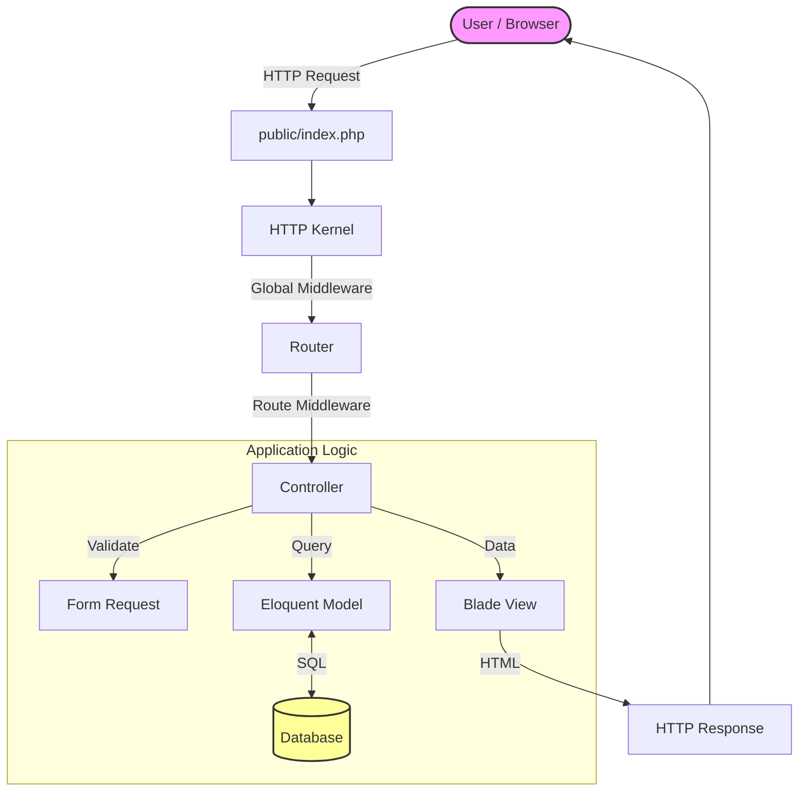

# 🚀 Laravel: The PHP Framework for Web Artisans

> **Dokumentasi Hidup**: Panduan ini dirancang untuk manusia (Developer) DAN mesin (AI Assistant). Tujuan utamanya adalah memberikan **konteks arsitektural** yang jelas dan **alur berpikir** yang benar dalam membangun aplikasi Laravel.

---

## 🗺️ Gambaran Besar Sistem

Laravel adalah kerangka kerja (framework) aplikasi web berbasis PHP dengan sintaks yang ekspresif dan elegan. Ia mengikuti pola arsitektur **MVC (Model-View-Controller)**.

### Kenapa Laravel Penting?

- **Batteries Included**: Datang dengan fitur lengkap (Auth, Queue, Cache) tanpa perlu konfigurasi rumit.
- **Developer Happiness**: Fokus pada DX (Developer Experience) dengan sintaks yang bersih.
- **Modern PHP**: Memanfaatkan fitur terbaru PHP untuk kode yang robust dan type-safe.

---

## 🔄 Lifecycle Request (Flowchart)

Bagaimana secangkir request diproses menjadi response?



---

## 🧩 Komponen Utama & Mental Model

### 1. Middleware: "Satpam" Aplikasi

**Apa ini?**  
Lapisan keamanan/filter yang memeriksa setiap request SEBELUM masuk ke Controller.

**🧠 Kenapa ini penting?**  
Mencegah request tidak sah (belum login, CSRF token salah, IP di-block) masuk ke logika bisnis utama.

**Kapan dipakai?**

- Cek login (`auth`)
- Cek role admin
- Trim string input
- Log activity

```php
// Contoh: Hanya boleh lewat jika umur > 18
public function handle($request, Closure $next)
{
    if ($request->age <= 18) {
        return redirect('home');
    }
    return $next($request);
}
```

### 2. Controller: "Polisi Lalu Lintas"

**Apa ini?**  
Otak yang menerima request, memanggil model/service lain, dan menentukan response apa yang dikirim balik.

**🧠 Kenapa ini penting?**  
Memisahkan logika aplikasi dari tampilan (View) dan data (Model). Menjaga kode tetap terorganisir.

**⚠️ Kesalahan Umum:**  
Menaruh logika bisnis yang kompleks di Controller ("Fat Controller"). Sebaiknya pindahkan ke Service Class atau Action Class.

### 3. Validation: "Pos Pemeriksaan Kualitas"

**Apa ini?**  
Mekanisme untuk memastikan data input sesuai format yang diharapkan sebelum diproses.

**🧠 Kenapa ini penting?**  
Mencegah `SQL Injection`, data korup, dan error aplikasi karena input sampah.

**Kapan dipakai?**  
Setiap kali menerima input dari user (Form Submit, API Request). Gunakan **Form Request** untuk validasi kompleks.

### 4. Eloquent ORM: "Penerjemah Database"

**Apa ini?**  
Object-Relational Mapper (ORM) yang memungkinkan Anda berinteraksi dengan database menggunakan sintaks PHP, bukan SQL mentah.

**🧠 Kenapa ini penting?**

- **Keamanan**: Otomatis menggunakan prepared statements (anti SQL Injection).
- **Abstraksi**: Ganti database (MySQL -> PostgreSQL) tanpa ubah kode query.
- **Produktivitas**: Relationship (One-to-Many, Many-to-Many) ditangani dengan mudah.

**Contoh:**

```php
// SQL: SELECT * FROM users WHERE active = 1;
$users = User::where('active', 1)->get();
```

### 5. Authentication & Authorization

- **Authentication (Auth)**: _"Siapa Anda?"_ (Login)
- **Authorization (Gate/Policy)**: _"Boleh tidak Anda melakukan ini?"_ (Permission)

**🧠 Kenapa ini penting?**  
Keamanan dasar aplikasi. Jangan pernah membuat sistem login sendiri dari nol kecuali Anda ahli kriptografi. Gunakan `Laravel Breeze` atau `Jetstream`.

### 6. CSRF Protection

**Apa ini?**  
Token rahasia yang digenerate server untuk memastikan form submit berasal dari aplikasi kita sendiri, bukan dari website jahat.

**⚠️ Kesalahan Umum:**  
Lupa menambahkan `@csrf` di form HTML, menyebabkan Error 419 Page Expired.

---

## 🔗 Hubungan Antar Komponen (Alur Data)

1. **User** mengirim data via Form -> **Route** menangkap URL.
2. **Middleware** memvalidasi sesi user & token CSRF.
3. **Controller** menerima request, memanggil **Validation**.
4. Jika valid, **Controller** memanggil **Model** untuk simpan data.
5. **Model** bicara dengan **Database**.
6. **Controller** mengembalikan **View** (halaman sukses) atau **Redirect**.

---

## 📝 Contoh Alur Nyata: Membuat Postingan Blog

Skenario: User ingin memposting artikel baru.

1. **Route**: `POST /posts` -> `PostController@store`
2. **Middleware**: Cek apakah user sudah login (`auth`).
3. **Form Request**: Validasi:
   - `title`: required, max 255 chars
   - `body`: required
4. **Controller**:
   - Panggil `Post::create($validatedData)`
   - Assign `user_id` dari `Auth::id()`
5. **Model**:
   - Simpan ke tabel `posts`
   - Set `created_at` timestamp otomatis
6. **Response**: Redirect ke halaman dashboard dengan flash message "Post Berhasil Dibuat".

---

## 🚫 Anti-Pattern & Kesalahan Umum

1. **N+1 Query Problem**:
   - ❌ **Salah**: Loop query di dalam view.
   - ✅ **Benar**: Gunakan Eager Loading (`with('comments')`) di Controller.
2. **Logic di View**:
   - ❌ **Salah**: Melakukan query database di file `.blade.php`.
   - ✅ **Benar**: Pass data dari Controller ke View.

3. **Mengabaikan Mass Assignment**:
   - ⚠️ **Bahaya**: User bisa menyisipkan field `is_admin = 1` di request.
   - ✅ **Solusi**: Selalu definisikan `$fillable` atau `$guarded` di Model.

---

## ⚖️ Kapan Pakai Laravel?

| ✅ Cocok Untuk                                                             | ❌ Kurang Cocok Untuk                                                                  |
| :------------------------------------------------------------------------- | :------------------------------------------------------------------------------------- |
| **Aplikasi SaaS / B2B** (Fitur lengkap Auth, Subscription, Team)           | **Simple Static Blog** (Gunakan Hugo/Jekyll/Astro)                                     |
| **E-Commerce** (Kompleksitas order, payment, shipping)                     | **Serverless Function** (Gunakan native Node/Go/Python)                                |
| **Enterprise App** (Butuh struktur jelas & maintainability jangka panjang) | **High Performance Real-time** (Game server, High frequency trading - Gunakan Go/Rust) |

---

## 🏁 Penutup

Laravel bukan sekadar framework, tapi ekosistem. Mempelajari Laravel berarti mempelajari **Modern PHP Development**.

- Fokus pada **Convention over Configuration**.
- Pahami **Lifecycle Request**.
- Jaga Controller tetap **Kurus**, Model tetap **Cerdas**.

Gunakan dokumen ini sebagai peta jalan saat Anda tersesat dalam kode. Happy Coding! 🚀
